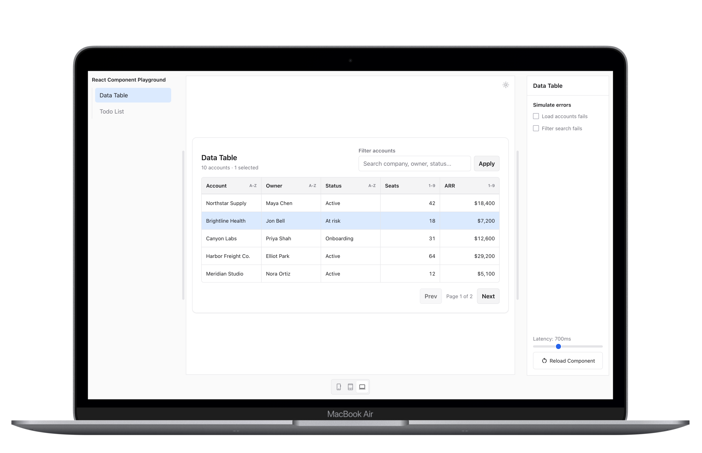

# React Component Playground

A playground for exploring how common web components should behave across real production states and edge cases, including loading, empty, error, and interactive states.

> See it live at [https://albho-react-component-playground.vercel.app/](https://albho-react-component-playground.vercel.app/)

## Currently Available Components

- [Data Table](https://albho-react-component-playground.vercel.app/#data-table)
- [Todo List](https://albho-react-component-playground.vercel.app/#todo-list)
